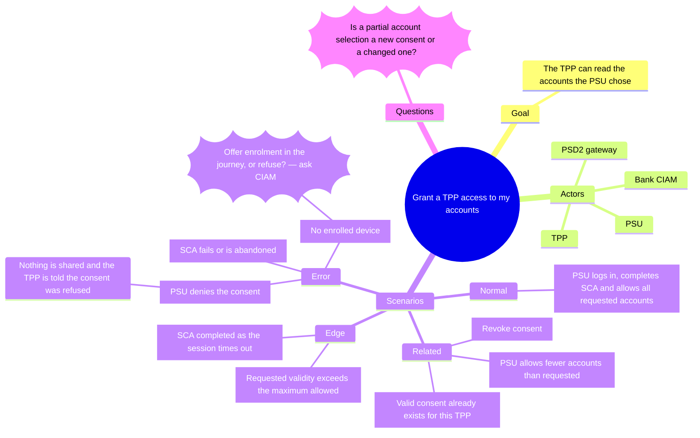

# AI-Driven SDLC Artefact Contract

## Purpose

These instructions define the expected content and relationships of artefacts generated during an AI-driven software-development journey.

Generate an artefact only when it answers a useful question. Every generated file must have a clear source, owner, purpose, and relationship to the other models.

## Problem and journey material

Preserve the original narrative or specification as an authoritative input. Record UX research findings, evidence, assumptions, pain points, desired outcomes, and accessibility needs without converting hypotheses into facts.

Journey Mapping supplies the outside-in experience view. Use stable identifiers for actors, journey stages, touchpoints, outcomes, and research evidence.

## Use Case Mapping

Generate one Mermaid mindmap per use case, as `docs/usecases/<UC-ID>.mmd`, following `docs/ai/notations/mindmap-notation.md`.

A use case map answers *who wants what from the system, and what surrounds that goal*. The root is the use case, named as a goal in the actor's words, with its identifier as the node id: `UC-GRANT-CONSENT((Grant a TPP access to my accounts))`. Its first-level branches are, in this order and with these names:

- `Goal` — the outcome the primary actor wants, and the objective it serves
- `Actors` — the primary actor and the supporting actors and systems
- `Trigger` — what starts it
- `Preconditions` — what must already be true
- `Outcomes` — the success outcome and the guarantees on failure
- `Scenarios` — every situation the use case must handle, in the four kinds below
- `Rules` — constraints, including regulatory ones, with their source
- `Questions` — open questions, as question nodes

Omit a branch that has nothing in it rather than filling it with a guess. A use case map lists situations; it does not order them. Order and causality belong to the Event Storm, which should reach every scenario the map names.

### Scenarios

Under `Scenarios`, map the use case's scenarios into exactly four second-level branches, in this order and with these names:

- `Normal`: the main success scenario. The primary actor reaches the goal in the usual way, with nothing unusual on the way. There is exactly one.
- `Related`: other ways of reaching the same goal, and the neighbouring use cases that start from or end in this one. Examples are consenting to fewer accounts than requested, reusing a valid consent, and renewing one that is about to expire. A neighbouring use case is named by its identifier, and its own map holds its scenarios.
- `Edge`: situations at the limit of a rule, where the outcome depends on which side of the boundary the situation falls. Examples are a consent that expires today, the last permitted access of the day, a transaction exactly 90 days old, and the same request submitted twice.
- `Error`: situations in which the goal is not reached. This covers a refusal by a rule, a failed or abandoned authentication, a timeout, and an unavailable system. Each one names the failure guarantee: what is still true for the PSU and the bank afterwards.

Each scenario is one node, named as a situation in a few words and carrying its identifier as the node id: `<kind letter><number>` appended to the use case identifier. The kind letters are `N`, `R`, `E`, and `X`, for example `UC-GRANT-CONSENT-E2`. A scenario may have children for the detail that makes it distinct, such as the rule it tests, the system that fails, or the outcome. Those children are not steps. A scenario whose kind nobody can settle goes under the kind that is most likely, and gets a question node beneath it.



The four kinds feed the rest of the artefacts:

- The `Normal` scenario and the `Related` scenarios are paths in the Event Storm.
- Each `Edge` scenario becomes at least one example tagged `+edge-case` in the Example Map of the story that covers it.
- Each `Error` scenario becomes an error event or a hotspot in the Event Storm, an example in the Example Map, and an error state on every screen where it can show.

A scenario that cannot reach any of these artefacts is either out of scope or not yet understood. Say which one; do not delete the scenario.

Use the vocabulary of `docs/context/terminology.md` and the systems of `docs/context/adr.md`. Mark hypotheses and questions as the notation says. Do not invent actors, regulatory rules, or outcomes the sources do not support.

## Event Storming

Generate `.eventstorm` files under `docs/journeys/` when domain behaviour needs exploration.

Use:

- Big Picture to explore the domain landscape, time, pivotal events, hotspots, actors, and external systems
- Process Modelling to develop commands, events, policies, alternate paths, and exceptions around an outcome
- System Design to assign software responsibility where the team needs implementation-level clarity

Do not resolve hotspots, remove meaningful disagreement, or invent domain facts.

## Story Mapping

Generate `.storymap` files under `docs/stories/`.

The Story Map should contain personas, activities, user steps, stories, alternatives, release objectives, coherent slices, and unscheduled work. Connect its backbone to the journey and pivotal events.

The Story Map owns product and release meaning. Ticketing owns operational workflow data. Generated tickets should retain the story identifier, journey position, release objective, source revision, and connected examples or contexts.

## Example Mapping

Generate `.examplemap` files under `docs/stories/` for stories requiring behavioural clarification.

Record the story, rules, concrete examples, boundary cases, and unanswered questions. Keep the `.examplemap` file as the discovery source. Treat executable scenarios and tests as downstream projections and evidence.

Do not answer open questions without evidence or invent accepted examples.

## UX Sketching

Generate one wiremd wireframe per screen, as `docs/ux/wireframes/<journey>/<screen>.md`, following `docs/ai/notations/wiremd-notation.md`. Render with `--style clean`.

Sketch a screen only for a story whose user actually sees something, and only once its example map exists. The sketch should show what is on the screen and in what order, using the rules and examples the room agreed. Record loading, empty, and error states as annotations. Record the screen identifier, the story, the owning system, and where the screen is presented in the screen header.

Respect ownership from `docs/context/adr.md`. Sketch each screen as presented by the system and channel that the ADR assigns to it. For example, the SCA screen is presented on the enrolled device by the Bank Mobile App, not in the browser. Do not move a screen to another channel or system to make a journey look simpler.

Do not treat a sketch as a visual design. Do not add brand, colour, or layout decisions that nobody asked for.

## HTML decks

Package the use case maps and the UX sketches as two HTML decks for review:

- `docs/usecases/usecases-deck.html` — one slide per use case map
- `docs/ux/ux-sketches-deck.html` — one slide per screen, grouped by journey in journey order

A deck is a projection of its sources, generated and never edited by hand. Each deck must be one self-contained HTML file that opens from disk with no build step and no server:

- A title slide with the deck's name, the source revision (commit), the generation date, the instruction files used, and the status *proposal*.
- An index slide listing every following slide by identifier and title.
- One slide per source file. Show its identifiers and links, meaning the use case, stories, journey, and screens it connects to, and the path of the source file. A use case slide also shows how many scenarios the map has of each kind (normal, related, edge, error), so a reviewer can spot at a glance a use case that has no edge or error scenarios yet.
- A closing slide collecting every open question from the sources, each with the identifier of the slide it came from.
- Keyboard navigation (arrow keys, Home, End), a slide counter, and a print stylesheet that prints one slide per page.

Render mindmaps in the browser with Mermaid, loaded from a pinned version on `cdn.jsdelivr.net`, with the diagram source embedded in the slide unchanged. Render each wireframe with `wiremd <file> --style clean`. Embed each result in its slide in an `<iframe srcdoc>`, so that wiremd's stylesheet cannot leak into the deck or into other slides.

Commit a deck in the same change as the sources it was generated from. A deck whose source revision does not match its sources is stale. Regenerate it rather than patching it. Each deck sits at the top of the folder whose sources it packages, and is the only generated file there.

## Context Mapping and Domain Modelling

Generate strategic `.ddd` files and tactical `.ddm` files under `docs/domain/`.

The strategic model should describe domains, subdomains, bounded contexts, ownership, context relationships, and language seams. Tactical models should describe aggregates, entities, value objects, domain events, policies, and invariants where that detail supports delivery.

Represent relationship power honestly. Do not create tidy boundaries for symmetry. Do not define an aggregate without a meaningful invariant or transactional reason.

## Architecture and technical contracts

Place architecture artefacts under `docs/system/`:

```text
docs/system/
├── c4/
│   └── *.likec4
├── uml/
│   └── **/*.puml
└── api/
    ├── openapi/
    │   └── *.yaml
    ├── asyncapi/
    │   └── *.yaml
    ├── graphql/
    │   └── **/*
    └── wsdl/
        └── *
```

Use C4 or LikeC4 for structural views. Use PlantUML for focused dynamic, state, class, component, or deployment views. Generate interface contracts only where the proposed design requires them.

Connect each architecture element to its bounded context and to the stories, examples, or events that justify it.

## Stable identifiers and traceability

Preserve stable identifiers across transformations. Generate a traceability manifest under `docs/traceability/`.

The manifest should support navigation across this chain:

```text
Objective
  → Journey and evidence
  → Use case and scenario
  → Pivotal event
  → Story and release slice
  → Rule and example
  → Screen
  → Bounded context and invariant
  → Component and interface
  → Implementation and test
  → Production evidence
```

An entry may use a structure such as:

```yaml
objective: OBJ-01
journey: JRN-ONBOARDING
use_case: UC-SUBMIT-APPLICATION
scenario: UC-SUBMIT-APPLICATION-N1
pivotal_event: EVT-APPLICATION-SUBMITTED
story: STORY-SUBMIT-APPLICATION
example_map: EXMAP-SUBMISSION
screen: SCR-APPLICATION-FORM
bounded_context: CTX-APPLICATION
component: CMP-SUBMISSION-API
delivery_pack: MVP-01
evidence: EVIDENCE-SUBMISSION-SLO
```

## Consistency

Consistency means that relationships are explicit and unexplained contradictions receive attention. Different disciplines may express different views of the same system.

Report:

- Missing or broken references
- Conflicting vocabulary
- Stories without journey context
- Use case scenarios that no Event Storm path reaches
- `Edge` scenarios without an `+edge-case` example, and `Error` scenarios without an error event, a hotspot, or an example
- Use cases without exactly one `Normal` scenario
- Stories with a user-facing screen but no UX sketch, and sketches without a story
- Screens presented by a system other than the one `docs/context/adr.md` assigns
- Rules without concrete examples
- Decks whose source revision does not match their sources
- Components without context ownership
- Interfaces without behavioural justification
- Delivery items without expected evidence
- Facts that lack a source
