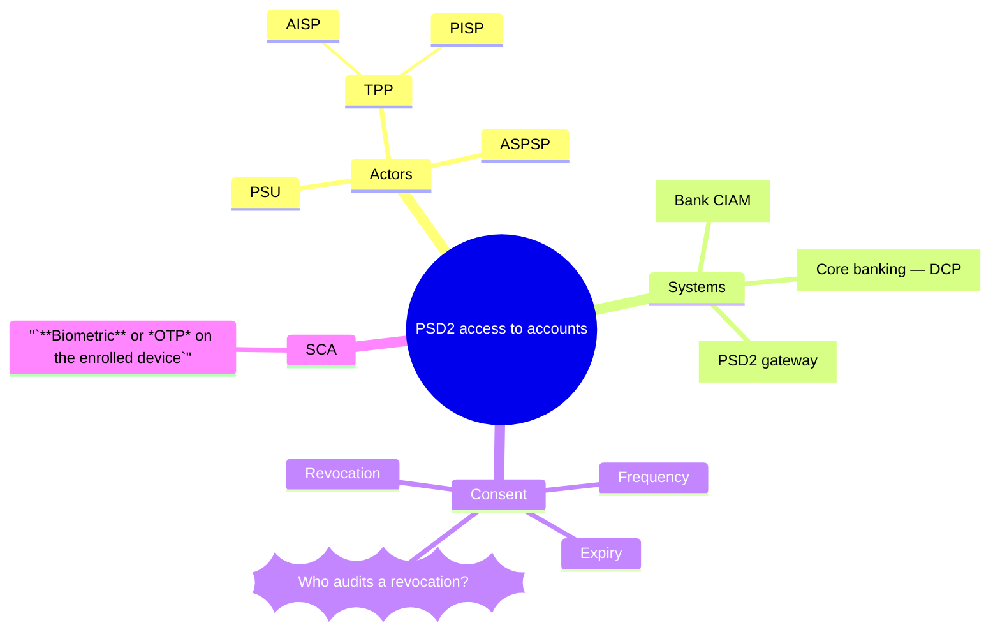

# Working with Mermaid mindmaps

You are being asked to read, write or change a mind map — a single topic broken
down into the ideas around it, kept as text, in the `mindmap` diagram type of
**Mermaid**. This document is the whole of that notation as this repository
uses it. Follow it exactly: a mindmap that does not parse renders as an error
box wherever it is embedded.

## The notation: `mindmap`



**Indentation is the tree.** A line is a child of the nearest line above it
that is indented less. There are no braces and no arrows: the only relation a
mindmap can say is *belongs under*.

**There is exactly one root**, the first node. Everything else is indented
beneath it.

**Shape is the delimiter around the text:**

| Written as        | Shape                     |
|-------------------|---------------------------|
| `Text`            | default (the renderer's)  |
| `id[Text]`        | square                    |
| `id(Text)`        | rounded square            |
| `id((Text))`      | circle                    |
| `id))Text((`      | bang                      |
| `id)Text(`        | cloud                     |
| `id{{Text}}`      | hexagon                   |

The `id` before a shape is optional and never shown; it is there so another
artefact can name the node.

**Decorations go on the line after the node, indented under it:**

- `::icon(fa fa-shield)` — an icon, by the icon font's class names. It renders
  only where the page has loaded that font.
- `:::question urgent` — one or more CSS classes, space separated.

**Markdown strings** are the text wrapped in `` "` `` and `` `" ``:
`` "`**bold** and *italic*`" ``. Inside one, a line break in the source is a
line break in the node and long text wraps on its own. Outside one, text is
plain.

Comments are `%%` to end of line, on a line of their own.

## The grammar, formally

EBNF. `,` is sequence, `|` is alternation, `{ x }` is zero or more, `[ x ]` is
optional, `? … ?` is prose, and a quoted literal stands for itself. Indentation
is not expressible in EBNF; it is described under the grammar.

```ebnf
File        = [ FrontMatter ] , 'mindmap' , Newline , Root , { Line } ;
FrontMatter = '---' , Newline , { ? YAML ? , Newline } , '---' , Newline ;
Root        = Indent , Node , Newline , { Indent , Decoration , Newline } ;
Line        = Indent , ( Node | Decoration ) , Newline
            | Indent , Comment , Newline
            | Newline ;

Node        = [ Id ] , Shape | Text ;
Shape       = '['  , Label , ']'
            | '('  , Label , ')'
            | '((' , Label , '))'
            | '))' , Label , '(('
            | ')'  , Label , '('
            | '{{' , Label , '}}' ;
Label       = Text | MdString ;
MdString    = '"`' , { ? any character except "`" ? } , '`"' ;
Decoration  = Icon | Classes ;
Icon        = '::icon(' , { ? any character except ")" ? } , ')' ;
Classes     = ':::' , ClassName , { ' ' , ClassName } ;

Id          = ( Letter | Digit | '_' ) , { Letter | Digit | '_' | '-' } ;
ClassName   = ( Letter | '_' ) , { Letter | Digit | '_' | '-' } ;
Text        = ? any characters except the shape delimiters and a line break ? ;
Comment     = '%%' , { ? any character except a line break ? } ;
Indent      = { ' ' | Tab } ;
```

Reading it:

- **Depth is relative, not counted.** A node's parent is the nearest earlier
  node with a smaller indent; the absolute number of spaces does not matter.
  Mis-indentation is therefore rarely an error — it is a node silently filed
  under the wrong parent. Indent with two spaces per level and never mix tabs in.
- **A second root is an error.** A line indented as little as the root, after
  the root, has no parent and fails the whole diagram.
- **A decoration belongs to the node above it**, whatever its indentation.
  Indent it under that node anyway so a reader sees it the same way.
- **Delimiters inside plain text break the parse.** `Call (optional)` is read
  as a node `Call` with a rounded label. Write it as a markdown string —
  `` "`Call (optional)`" `` — or reword.
- **Front matter configures, it does not model.** The one setting this
  repository uses is `config: { layout: tidy-tree }` for a wide map; anything
  else is presentation and stays out of the file.

## Where a mindmap lives

- **Embedded**, in a fenced ```` ```mermaid ```` block in a Markdown file,
  when the map illustrates the prose around it. GitHub, GitLab and most
  Markdown previews render it in place.
- **On its own**, as `docs/…/<name>.mmd`, when other artefacts point at it or
  it is rendered in the pipeline (`mmdc -i name.mmd -o name.svg`).

Never commit the rendered SVG next to the source; it is a projection. Use case
maps live in `docs/usecases/<UC-ID>.mmd` and reach reviewers through the
use-case deck, which embeds their source unchanged and renders it in the
browser — see `10-artifact-contract.md`.

## What a mindmap is for here — and what it is not

A mindmap says *these ideas belong under that one*. It is the right tool for
the early, divergent part of the orchestration in `00-ai-driven-sdlc-orchestration.md`:
breaking a problem narrative into areas, laying out the vocabulary before
`docs/context/terminology.md` is written, listing actors and systems before an
event storm, collecting the open questions of a topic in one picture.

It is the wrong tool for anything with a direction, an order or a rule:

- **Time and causality** belong in the `.eventstorm`. A mindmap branch
  "Consent → SCA → Token" reads like a flow and says nothing about one.
- **Boundaries and ownership** belong in the `.ddd` context map. Grouping two
  systems under one branch is not a bounded context.
- **Release slicing** belongs in the `.storymap`.

When a mindmap starts wanting arrows, it has become one of those artefacts;
move the content there and let the mindmap point at it.

## Conventions in this repository

- **The root names the question, not the product.** `((Consent lifecycle))`,
  not `((Bank))`.
- **Terms come from `docs/context/terminology.md`.** A node that uses a
  different word for a term already defined there is a vocabulary conflict, and
  the validation report must list it. A term that is not yet defined is a
  candidate for the terminology, not a licence to invent a synonym.
- **Open questions are bang nodes with the `question` class:**
  `q1))Who audits a revocation?((` then `:::question` beneath it. The shape
  makes them visible, the class makes them findable, and the id lets the
  unresolved-question ledger point at them. End the text with `— ask <team>` when
  somebody is known to hold the answer — the same *ask* spelling as on the other
  boards, without the parentheses, which would close the node's shape.
- **Hypotheses are cloud nodes** (`id)Text(`); facts are default or square.
  The map must not make a guess look like a finding.
- **Ids only where something points at the node.** An id nobody references is
  noise; an id something references must never change.
- **Keep it to one screen.** More than about four levels or forty nodes is a
  map of several topics; split it and give each its own root.

## Changing somebody's mindmap

- **The whole diagram**, not a fragment. It replaces the block or the file.
- **Change only what was asked for.** Everything else comes back
  byte-identical — including the indentation, because here indentation is the
  meaning.
- **Keep the comments.** They are the author's reasoning.
- **Never answer a question node by deleting it or reshaping it.** A question
  is closed by the people who own the answer. If you think you know it, say so
  in prose and leave the node.
- **Never change a node id.**
- **It must parse.** One root, no stray delimiters in plain text. A diagram
  that does not parse is not a smaller version of one that does; it is an error
  box in the middle of somebody's document.

---

*Written against the Mermaid `mindmap` syntax as documented in
`packages/mermaid/src/docs/syntax/mindmap.md` in mermaid-js/mermaid. Where a
diagram and this document disagree, the Mermaid parser is right and this file
is old.*
