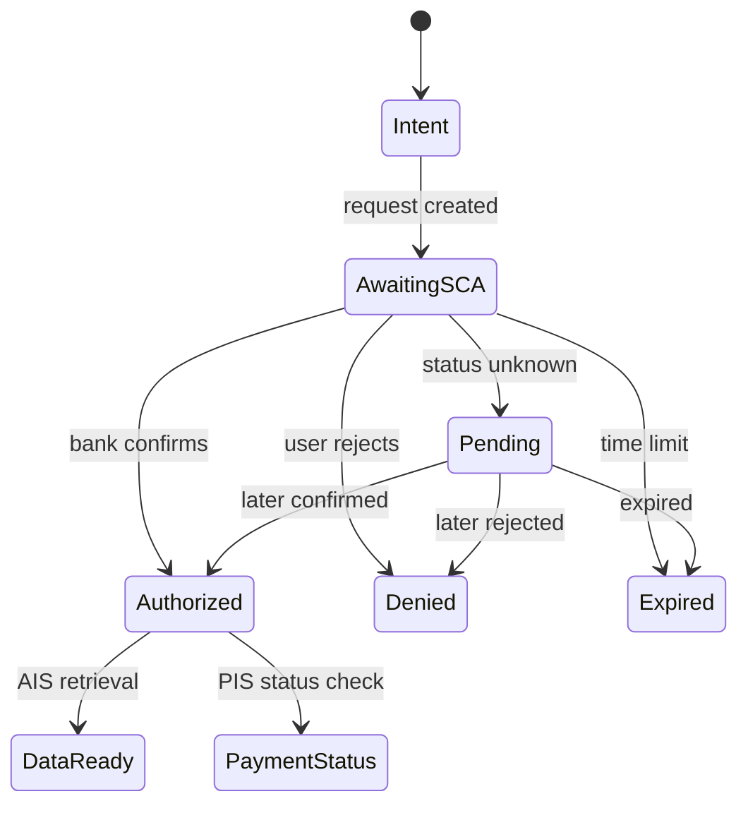

# Open Banking SCA wireflow matrix

**Scope:** six reference journeys: AIS or PIS × redirect, decoupled, or embedded authentication. These are UX design patterns, not a claim that every ASPSP offers each approach. Adapt the exact consent, API status, timing, and authentication screens to the bank, scheme, and jurisdiction. The examples assume SCA is required; an applicable exemption or delegated approach changes the path. [Open Banking authentication methods](https://standards.openbanking.org.uk/customer-experience-guidelines/authentication-methods/latest/)

**Actors:** TPP = AISP/PISP product; bank = ASPSP; PSU = customer. Screen ownership is shown as **TPP** or **bank**. A bank-app notification is a bank surface. A success screen in a TPP is displayed only after the TPP confirms the relevant API status.

## At a glance

| Service | Redirect | Decoupled | Embedded |
| --- | --- | --- | --- |
| **AIS** | TPP selects bank and explains handoff → bank authenticates and confirms data/accounts → TPP retrieves permitted data. | TPP requests connection and waits → bank app prompts customer to approve access → TPP observes authorization and retrieves data. | TPP collects the bank-supported authentication input/challenge → bank verifies and authorizes consent → TPP retrieves data. |
| **PIS** | TPP reviews payment and hands off → bank authenticates and confirms amount/payee → TPP checks payment status. | TPP submits payment and waits → bank app reviews and approves the bound payment → TPP checks payment status. | TPP displays payment and collects bank-supported challenge response → bank verifies dynamic link and authorizes → TPP checks payment status. |

### Shared screen contract

| Screen/state | Minimum content and action |
| --- | --- |
| TPP intent | Name the bank and TPP, explain the requested account data or payment, and provide a clear cancel path. |
| Bank AIS consent | Identify TPP, permissions, accounts and access terms; display the bank's actual consent controls. |
| Bank PIS confirmation | Prominently display amount, payee, debit account where known, and any material reference; make the approval action unambiguous. |
| Pending | State where approval occurs and that the request is still waiting; offer a safe status refresh or return path. |
| TPP result | Distinguish “account access authorized,” “data loaded,” “payment authorized/submitted,” and “payment executed/settled” according to verified status. |

## 1. AIS × Redirect

**Primary channels:** app→bank app→app, or web→bank web→web. [App based AIS journey](https://standards.openbanking.org.uk/customer-experience-guidelines/authentication-methods/redirection-app-based-redirection-ais/latest/)

| Step | Owner | Screen / interaction | Next condition |
| --- | --- | --- | --- |
| A1 | TPP | “Connect an account”; choose bank, explain data and purpose. | Bank selected. |
| A2 | TPP | Handoff: “Continue in {bank} to choose accounts and allow access.” | Open bank authorization URL/app. |
| A3 | Bank | Identify customer if needed; authenticate with a supported method. | Authentication passes. |
| A4 | Bank | Show TPP name, access scope, terms, eligible accounts; customer confirms or rejects. | Consent authorized. |
| A5 | Bank→TPP | Return through redirect/deep link; TPP resolves callback and obtains confirmed authorization status. | Authorized and API ready. |
| A6 | TPP | “Accounts connected”; show selected accounts only after permitted data is available. | Journey complete. |

**Recovery branches:** A2 app missing/deep link fails → supported browser path or retry with context preserved. A3 authentication fails/locks → bank-owned recovery; TPP return explains that connection did not complete. A4 declined → “Access not granted”; retry begins a fresh consent. A5 return lost → resume by request reference and query status; never treat return alone as success. A5 pending/unavailable → “Still connecting,” then retry status check or start over when definitive. Expired consent → fresh authorization.

## 2. AIS × Decoupled

**Primary channels:** TPP web/POS/other device + bank mobile app. The bank may identify the PSU with a static, bank-generated, TPP-generated, or previously retained identifier. [Open Banking decoupled models](https://standards.openbanking.org.uk/customer-experience-guidelines/authentication-methods/latest/)

| Step | Owner | Screen / interaction | Next condition |
| --- | --- | --- | --- |
| B1 | TPP | Choose bank; explain data and purpose; collect only the identifier required by the chosen bank model. | Request created. |
| B2 | TPP | “Check {bank} on your phone to approve account access”; show waiting indicator, expiry guidance and cancel. | Bank challenge delivered or discoverable. |
| B3 | Bank | Push notification or in-app pending request; identify and authenticate customer. | Customer reviews request. |
| B4 | Bank | Show TPP, permissions, accounts and terms; approve or decline. | Bank records result. |
| B5 | TPP | Refresh/poll status within the bank's limits; update waiting screen. | Consent authorized. |
| B6 | TPP | Retrieve permitted data; show connected accounts and scope. | Journey complete. |

**Recovery branches:** No notification → “Open your banking app and look for pending requests”; offer resend only if API permits, plus identifier correction/restart. Wrong device/customer → bank-controlled rejection and fresh request. User declines → denied state; do not keep waiting. Timeout → expired state with “Start again.” TPP tab closes → resume by stable request reference and confirm status. Bank unavailable/pending too long → status check and a clear support route; no optimistic success.

## 3. AIS × Embedded

**Applicability:** only when the bank/API actually supports embedded authentication and the TPP can safely implement its method. Customer authentication input travels through the TPP interface. [EBA characterization, as reproduced in Open Banking guidance](https://standards.openbanking.org.uk/customer-experience-guidelines/authentication-methods/latest/)

| Step | Owner | Screen / interaction | Next condition |
| --- | --- | --- | --- |
| C1 | TPP | Choose bank; explain data access and that the bank will verify identity within this flow. | Consent request created. |
| C2 | TPP, bank-defined | Ask only for the supported PSU identifier and authentication input; identify clearly which bank is verifying it. | Bank accepts or issues challenge. |
| C3 | TPP, bank-defined | Present bank-specified challenge/method choice; capture response in the prescribed form. | Bank verifies SCA. |
| C4 | TPP, bank-defined | Show bank-provided consent scope/accounts where the API permits selection; submit customer decision. | Consent authorized. |
| C5 | TPP | Confirm authorization, retrieve data, show selected accounts and permissions. | Journey complete. |

**Recovery branches:** Unsupported authentication method → switch to a supported bank flow and preserve consent intent. Incorrect/expired challenge → bank-defined retry or restart; show remaining attempts only if supplied. Identifier mismatch → correction. Rejected consent → access denied. API state uncertain → pending screen and status query. Never ask the customer to re-enter a secret merely because the TPP lost its own session; use the bank's restart procedure.

## 4. PIS × Redirect

**Primary channels:** checkout/app→bank web/app→checkout/app. [App based PIS journey](https://standards.openbanking.org.uk/customer-experience-guidelines/authentication-methods/redirection-app-based-redirection-pis/latest/)

| Step | Owner | Screen / interaction | Next condition |
| --- | --- | --- | --- |
| D1 | TPP | Review amount, payee, source account if selected, reference and payment timing. | Customer chooses pay by bank. |
| D2 | TPP | Handoff naming the bank and describing the return to checkout. | Bank opens. |
| D3 | Bank | Identify/authenticate customer with supported method. | Authentication passes. |
| D4 | Bank | Display exact amount and payee bound to authorization; choose debit account if needed; clear confirm/cancel. | Payment authorized or rejected. |
| D5 | Bank→TPP | Return; TPP checks payment initiation/execution status through the API. | Authoritative status known. |
| D6 | TPP | Show “Submitted,” “Pending,” or “Completed” as supported by status; include payment reference. | Journey complete or tracking. |

**Recovery branches:** Bank app absent/return fails → supported browser path or resume; check status before offering retry. Amount/payee mismatch at bank → stop and restart from corrected payment, never silently alter the authorization. User cancels/rejects → payment not authorized. Authentication failure/expiry → bank recovery or fresh payment authorization. Unknown result → “Checking payment”; query status before a new initiation to avoid duplicate payment. Payment rejected after SCA → show rejection separately from authentication failure.

## 5. PIS × Decoupled

**Primary channels:** desktop checkout or POS + bank mobile app. The TPP waiting screen and bank notification must refer to the same payment. [Open Banking decoupled guidance](https://standards.openbanking.org.uk/customer-experience-guidelines/authentication-methods/latest/)

| Step | Owner | Screen / interaction | Next condition |
| --- | --- | --- | --- |
| E1 | TPP | Review amount, payee, source account if known, reference; choose bank and identification model. | Payment request created. |
| E2 | TPP | “Approve €X to {payee} in {bank}”; waiting screen with expiry/cancel and request reference. | Bank request available. |
| E3 | Bank | Notification or pending request identifies payment; customer opens bank app and authenticates. | Customer sees details. |
| E4 | Bank | Show bound amount and payee, debit account, and explicit approval. | Authorization outcome recorded. |
| E5 | TPP | Poll/receive status; distinguish authorization from execution. | Definitive outcome or continued pending. |
| E6 | TPP | Show appropriate payment status and reference; proceed with checkout only under the merchant's confirmed-state policy. | Journey complete or tracking. |

**Recovery branches:** No push → direct customer to pending requests, allow permitted resend or identification correction. Decline → stop waiting and show “Payment not approved.” Expiry → restart with a new request. Desktop session lost → recover by reference. API unavailable/ambiguous → keep payment pending and reconcile before another initiation. If payment details change, create a new authorization linked to the new amount/payee. [PSD2 Article 97 and dynamic linking](https://www.eba.europa.eu/regulation-and-policy/single-rulebook/interactive-single-rulebook/16226)

## 6. PIS × Embedded

**Applicability:** only for an ASPSP-supported embedded method that can satisfy the payment's SCA and dynamic-linking requirements. The TPP must display the transaction being authorized before collecting the bank's challenge response. [Open Banking authentication methods](https://standards.openbanking.org.uk/customer-experience-guidelines/authentication-methods/latest/)

| Step | Owner | Screen / interaction | Next condition |
| --- | --- | --- | --- |
| F1 | TPP | Review exact amount, payee, debit account if known, and reference. | Payment request created. |
| F2 | TPP, bank-defined | Collect supported identifier/authentication input and show bank identity. | Bank challenges or accepts. |
| F3 | TPP, bank-defined | Show the amount/payee associated with the bank's challenge; collect response through bank-defined controls. | Bank validates SCA and link. |
| F4 | TPP | Submit/confirm bank-defined authorization step if required. | Bank records authorization. |
| F5 | TPP | Query payment status and show submitted/pending/completed/rejected accurately. | Journey complete or tracking. |

**Recovery branches:** Wrong/expired code → bank-defined retry; changed amount/payee → abandon old challenge and create a fresh linked request. Method unavailable → offer supported redirect/decoupled flow. Declined or blocked → show bank outcome. Unknown result → reconcile by request/payment ID before retrying to avoid duplicates.

## Common state model and design rules

| Cross-cutting case | UX response |
| --- | --- |
| SCA method selection / multiple PSUs | Show the bank-supported options and account/user selection at the appropriate bank-owned or bank-defined step; preserve intent on return. |
| Cancel vs reject vs fail | Keep distinct states and language; cancel is a customer action, reject is a bank/customer decision, fail is a technical/authentication issue. |
| Duplicate callback or polling result | Make the TPP transition idempotent; show one stable result for the same consent/payment. |
| Consent authorized but data retrieval fails | Say access was granted but data could not load; allow retry or revoke/reconnect, rather than claiming no consent. |
| Payment authorized but execution pending | State “Payment pending/submitted” with reference; do not promise settlement. |
| Accessibility and device switching | Provide text instructions, visible bank name, keyboard/screen reader friendly focus, and a return path that survives app/browser switching. |
| AIS followed by PIS | Model separate account-access and payment decisions. Reuse of an earlier SCA element is conditional; payment dynamic linking must still be met. [EBA Q&A 2025_7358](https://www.eba.europa.eu/single-rule-book-qa/qna/view/publicId/2025_7358) |

### Source and interpretation notes

- [Open Banking Customer Experience Guidelines, Authentication Methods](https://standards.openbanking.org.uk/customer-experience-guidelines/authentication-methods/latest/) describes redirect and decoupled journeys, parity, identification models, and the EBA's three-approach taxonomy. Its detailed UX requirements are for that standard; this matrix uses them as design references outside their jurisdiction.
- [Open Banking app based AIS](https://standards.openbanking.org.uk/customer-experience-guidelines/authentication-methods/redirection-app-based-redirection-ais/latest/) and [PIS](https://standards.openbanking.org.uk/customer-experience-guidelines/authentication-methods/redirection-app-based-redirection-pis/latest/) illustrate the redirect screens.
- [Berlin Group NextGenPSD2](https://www.berlin-group.org/psd2-access-to-bank-accounts) describes the European XS2A framework and its SCA architectures. Actual field names and status values must follow the bank's supported profile.
- [EBA PSD2 Article 97](https://www.eba.europa.eu/regulation-and-policy/single-rulebook/interactive-single-rulebook/16226) is the basis for SCA and payment dynamic linking. The screen copy and recovery recommendations above are design inferences rather than quoted regulatory requirements.
