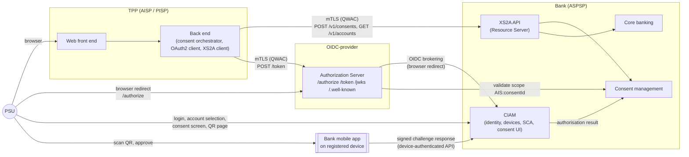
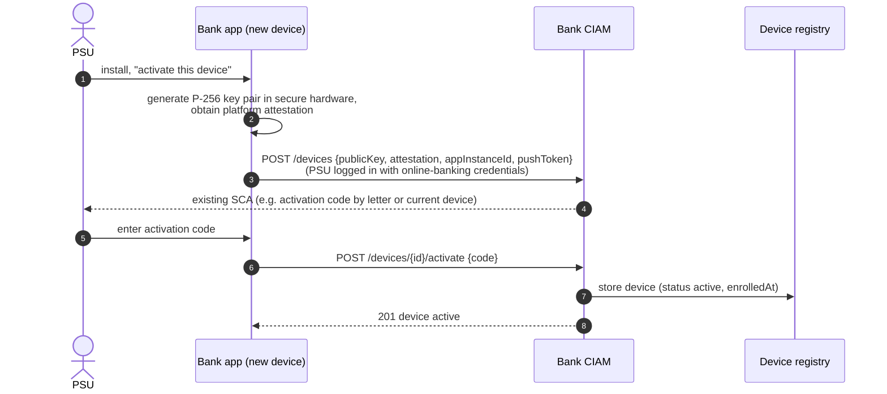
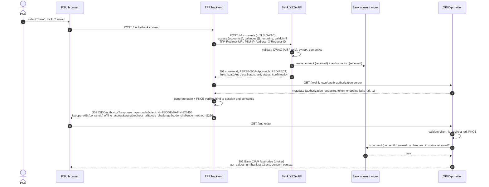
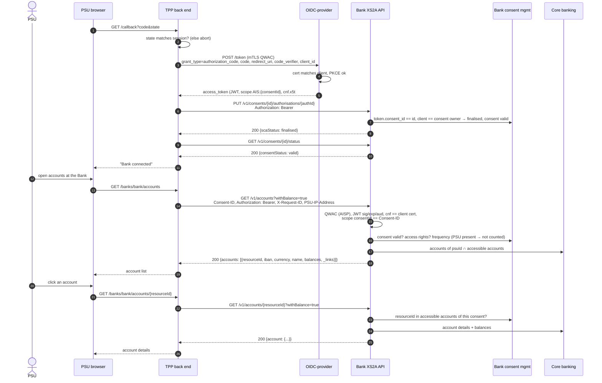
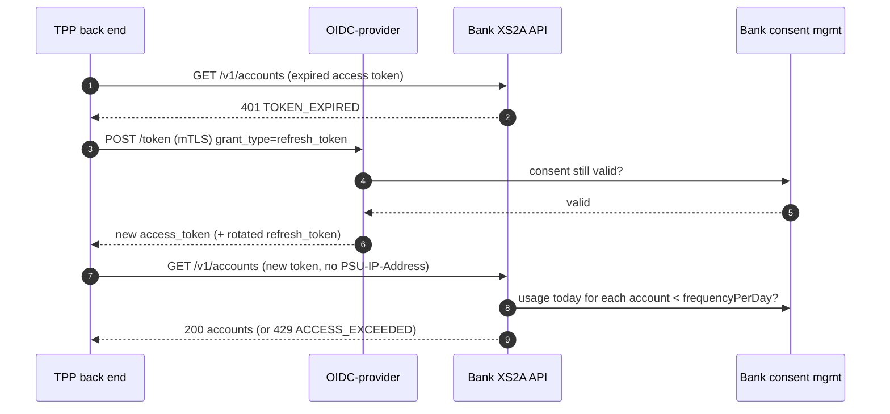
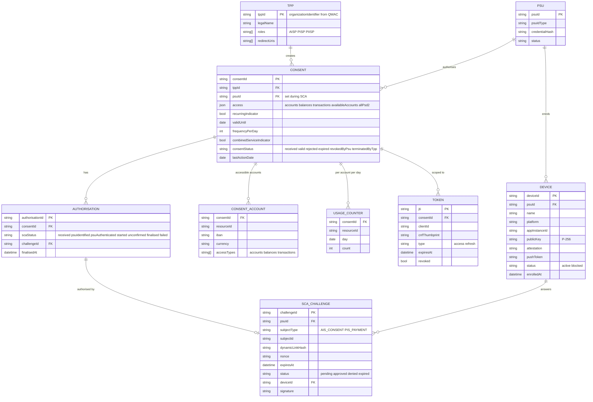
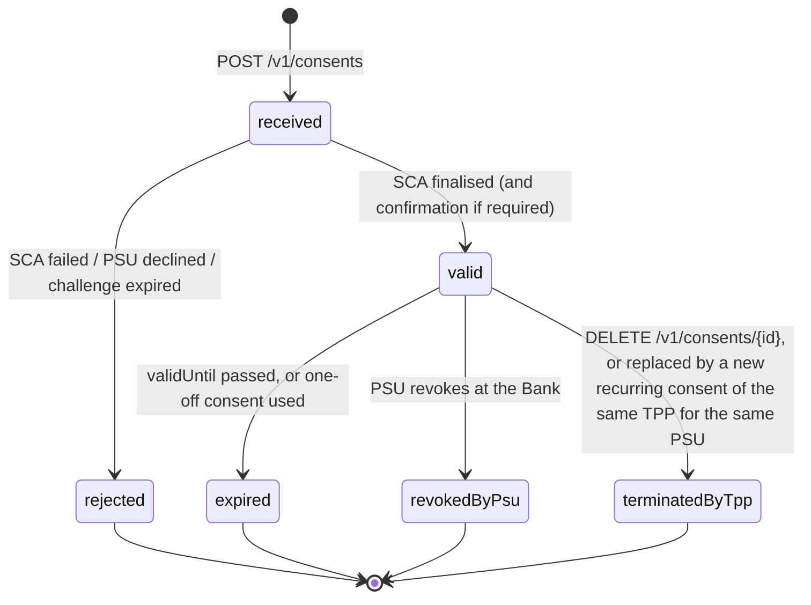
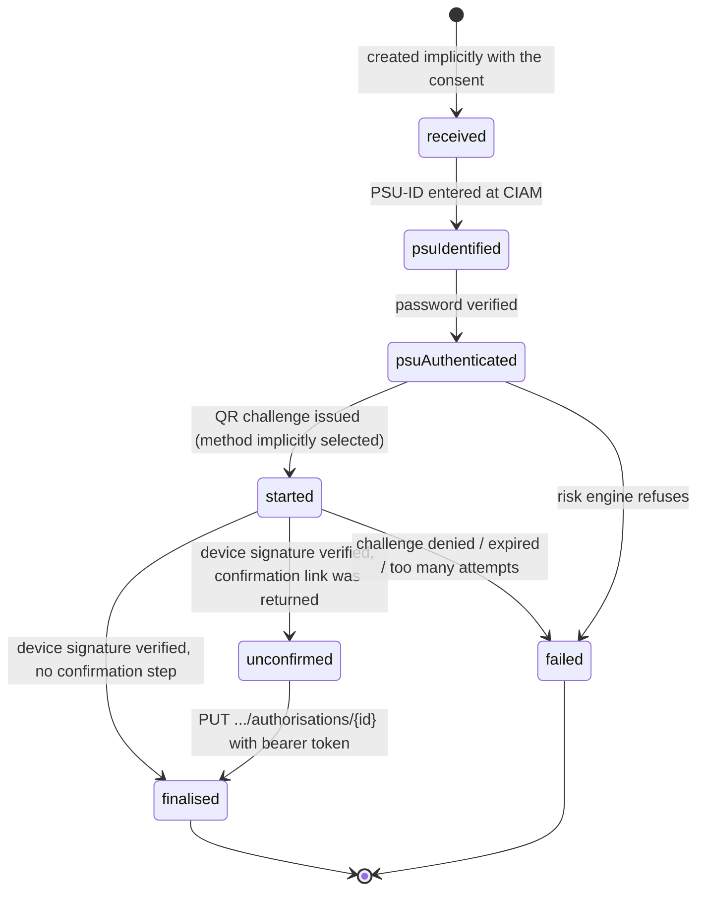
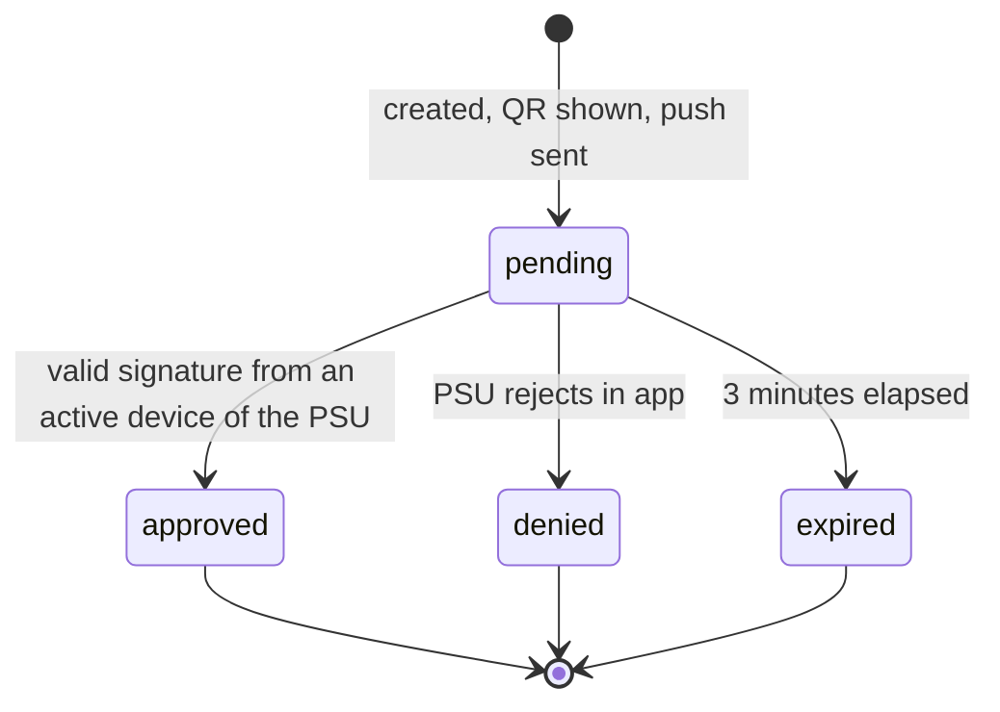

# PSU account-list journey — system design

**Journey.** A Payment Service User (PSU) opens a third-party application, **the TPP** (acting as AISP), selects **the Bank** from a list of registered banks, gives consent, authenticates at the Bank with strong customer authentication (password + a QR challenge approved on a registered mobile device), and then views the list of accounts held at the Bank and the details of the accounts they pick.

**Basis.** NextGenPSD2 XS2A Framework Implementation Guidelines v1.3.16 (`docs/xs2a/NextGenPSD2 XS2A Framework.pdf`). Section numbers below (e.g. §6.3.1) refer to that document. OAuth 2.0 / OpenID Connect references are given by RFC number.

**Contents**

1. [Roles](#1-roles)
2. [Key design decisions](#2-key-design-decisions)
3. [System context](#3-system-context)
4. [Containers](#4-containers)
5. [User journey, step by step](#5-user-journey-step-by-step)
6. [Sequence diagrams](#6-sequence-diagrams)
7. [Message contracts](#7-message-contracts)
8. [Data model](#8-data-model)
9. [State machines](#9-state-machines)
10. [Security controls](#10-security-controls)
11. [Error handling](#11-error-handling)
12. [Payment initiation service](#12-payment-initiation-service)
13. [Sandbox realisation](#13-sandbox-realisation)
14. [Assumptions and open points](#14-assumptions-and-open-points)
15. [Business analysis of the domain](#15-business-analysis-of-the-domain)
16. [PlantUML attachments](#16-plantuml-attachments)
17. [ASPSP compliance increments](#17-aspsp-compliance-increments)

**Models as code.** The journey, the backlog and the domain are kept as text next to this document, in grammars that diff and review like code:

| Model | File | Grammar |
|---|---|---|
| Event storm of the PSU journey (software-design level; lanes per party, one column per moment) | [`eventstorming/psu-account-list-journey.eventstorm`](eventstorming/psu-account-list-journey.eventstorm) | `.eventstorm`, doc-es.obya.ch/dsl |
| Event storm of the payment journey, the backbone of the payment story map | [`eventstorming/psu-payment-journey.eventstorm`](eventstorming/psu-payment-journey.eventstorm) | `.eventstorm`, doc-es.obya.ch/dsl |
| Story map whose backbone is that event storm: one activity per phase between pivotal events, one step per timeline column, stories sliced into deliveries | [`storymap/psu-account-list-journey.storymap`](storymap/psu-account-list-journey.storymap) | `.storymap`, doc-sm.obya.ch/dsl |
| Story map of the Bank's payment services, backbone the payment event storm (increments 4 and 5) | [`storymap/aspsp-payment-services.storymap`](storymap/aspsp-payment-services.storymap) | `.storymap`, doc-sm.obya.ch/dsl |
| Story map of what the interface owes every TPP whatever the service (increments 3 and 7) | [`storymap/aspsp-interface-conformance.storymap`](storymap/aspsp-interface-conformance.storymap) | `.storymap`, doc-sm.obya.ch/dsl |
| Example maps, one per story of the story map: business rules, examples with Given/When/Then steps and concrete values (nominal, edge and error cases), open questions | [`examplemap/`](examplemap/) (index and shared fixtures in [`examplemap/README.md`](examplemap/README.md)) | `.examplemap`, doc-em.obya.ch/dsl |
| Context map: domains, subdomains, bounded contexts and their relationships | [`domain/psd2-access-to-account.ddd`](domain/psd2-access-to-account.ddd) | `.ddd`, ba-cm.obya.ch/dsl |
| Domain models, one per bounded context: aggregates, roots, entities, values, enums, invariants | [`domain/consent-management.ddm`](domain/consent-management.ddm), [`domain/account-information.ddm`](domain/account-information.ddm), [`domain/customer-identity-and-sca.ddm`](domain/customer-identity-and-sca.ddm), [`domain/token-issuance.ddm`](domain/token-issuance.ddm), [`domain/bank-connection.ddm`](domain/bank-connection.ddm), [`domain/payment-initiation.ddm`](domain/payment-initiation.ddm), [`domain/tpp-identification.ddm`](domain/tpp-identification.ddm) | `.ddm`, ba-cm.obya.ch/dsl#ddm |
| C4 model in LikeC4: notation, model (people, systems, containers, components, relationships) and views (landscape, one per system, CIAM components, and the five journey sequences as dynamic views) | [`likec4/specs.c4`](likec4/specs.c4), [`likec4/model.c4`](likec4/model.c4), [`likec4/views.c4`](likec4/views.c4) | LikeC4 DSL, likec4.dev/dsl |

**How the story map follows the event storm.** Each activity of the story map is a phase of the event storm between two pivotal events, and each step is one timeline column:

| Event storm columns | Pivotal event closing the phase | Story map activity |
|---|---|---|
| 1 | Device enrolled at the Bank | Enrol a device at the Bank |
| 2 to 4 | The Bank selected, Consent created with status received | Connect the Bank from the TPP |
| 5 to 9 | Challenge response verified against the registered device key | Authenticate and approve at the Bank |
| 10 to 11 | Access token issued, Consent valid, the Bank connected | Complete the connection |
| 12 to 13 | Account list read, Account details read | View my accounts |
| 14 | Consent expired or revoked | Come back later |

The PlantUML sources of every diagram in this document are listed in [section 16](#16-plantuml-attachments). The LikeC4 model is browsed with `npx likec4 start docs/design/likec4` and checked with `npx likec4 validate docs/design/likec4`; its dynamic views can be switched to the sequence variant in the viewer.

---

## 1. Roles

| Party | PSD2 role | OAuth2 / OIDC role | Responsibility in this journey |
|---|---|---|---|
| **PSU** | Payment service user | Resource owner | Selects the bank, approves the consent, performs SCA. |
| **TPP** | AISP (also licensed PISP) | Confidential OAuth2 client, authenticated by mTLS with its eIDAS QWAC | Creates the consent at the Bank, drives the authorisation-code flow with the OIDC-provider, calls the XS2A API with the access token. |
| **OIDC-provider** | Part of the ASPSP's access infrastructure | Authorization Server (RFC 6749, RFC 8414 metadata) and OpenID Provider towards the TPP | Validates the TPP client, delegates PSU authentication and consent approval to the Bank's CIAM, issues certificate-bound access and refresh tokens scoped to one consent. |
| **Bank XS2A API** | ASPSP interface | Resource Server | Exposes `/v1/consents` and `/v1/accounts` (and `/v1/payments` for PIS). Validates QWAC, token and consent on every call. |
| **Bank CIAM** | ASPSP | Identity Provider upstream of the OIDC-provider | Owns customer identities, credentials, the device registry, the SCA engine (QR / push challenges) and the consent-approval user interface. |
| **Bank mobile app on a registered device** | Possession element of SCA | Authenticator | Scans the QR code, shows what is being approved, signs the challenge with a device-bound key. |
| **Bank consent management** | ASPSP | — | Stores consents and authorisation sub-resources, enforces access rights, validity and access frequency. |
| **Bank core banking** | ASPSP | — | Source of accounts, balances, transactions. |

The Bank is a **CIAM** (customer identity and access management) rather than a plain IdP because a PSU identity carries a set of enrolled devices, and the possession factor of SCA is a cryptographic key held by one of those devices.

---

## 2. Key design decisions

| # | Decision | Rationale and spec reference |
|---|---|---|
| **D1** | **SCA approach: integrated OAuth2 SCA approach.** The consent is first created on the XS2A API, then authorised through an OAuth2 authorization-code flow at the OIDC-provider with `scope=AIS:<consentId>`. | This is exactly the second OAuth2 integration described in §4.3 and the AIS flow in §6.1.1.2, with the OAuth2 profile of §13. It satisfies the requirement that the access token is issued by the OIDC-provider, keeps PSU credentials away from the TPP, and lets the Bank show the consent details itself (§6, "consent models"). The XS2A response announces it with `ASPSP-SCA-Approach: REDIRECT` and a `scaOAuth` link (§6.3.1.1). |
| **D2** | **Consent model: bank-offered consent** (`access.accounts: []`, `access.balances: []`, recurring). The PSU chooses at the Bank which accounts the TPP may see. | §6.3.1.2 "Consent Request without Indication of Accounts". One SCA covers both the account list and the later account-detail calls. An alternative with two consents is described in §14 of this document. |
| **D3** | **OIDC-provider brokers authentication to the Bank's CIAM** (OIDC identity brokering). The login, account selection, consent screen and QR challenge all run on the Bank's pages. The OIDC-provider only sees the result (ID token with `acr`, `amr`, `consent_id`). | The Bank must display the consent to the PSU during SCA (§6, consent models) and only the Bank owns the device registry. The OIDC-provider stays a generic authorization server. |
| **D4** | **Tokens are JWTs, certificate-bound, short-lived; refresh tokens are bound to the consent.** Access token ≈ 10 min, refresh token until `validUntil` of the consent. | §13.3 mandates "OAuth 2.0 Mutual TLS Client Authentication and Certificate Bound Access Tokens" (RFC 8705). §13.5 allows refresh tokens for AIS when `offline_access` is requested or `recurringIndicator` is true. |
| **D5** | **TPP token is necessary but not sufficient.** The XS2A API checks the consent (status, access rights, TPP ownership, frequency) on every call, and the `Consent-ID` header must equal the `consentId` in the token scope. | §6.5.1: "the addressed list of accounts depends on the PSU ID and the stored consent addressed by consent Id, respectively the OAuth2 access token". Consent revocation by the PSU takes effect immediately even while a token is still valid. |
| **D6** | **SCA = knowledge + possession with dynamic linking.** Factor 1: PSU-ID and password on the Bank's page. Factor 2: a challenge shown as a QR code (and optionally pushed) that the registered the Bank app signs with a hardware-backed key after the PSU approves on the device. The challenge hash covers the consent id, TPP name, selected accounts and validity. | EBA RTS on SCA (Art. 4–9): two independent elements, dynamic linking, possession proven by a device-bound key. Maps to the spec's `PHOTO_OTP` / `PUSH_OTP` authentication types (§14.9) but is executed entirely on the Bank's side, so the TPP never handles the challenge. |
| **D7** | **Implicit start of the authorisation process.** `POST /v1/consents` creates the authorisation sub-resource automatically and returns its `scaStatus` link. | §4.6 "optimisation process", §6.1.1.2, and the example "OAuth2 approach with an implicit generated authorisation resource" in §6.3.1.1. Multilevel SCA (corporate accounts) is out of scope. |
| **D8** | **Confirmation call is supported** (`confirmation` link). After the token is obtained, the TPP calls `PUT /v1/consents/{id}/authorisations/{authId}` with the bearer token. | §7.6 and §7.6.4 ("example for integrated OAuth solution"). It gives the Bank a proof that the party holding the token is the party that created the consent, and gives the TPP an explicit `finalised` result. The Bank may omit the link, in which case the TPP goes straight to the status call. |
| **D9** | **Every XS2A and OAuth2 endpoint requires mTLS with the TPP's QWAC.** `client_id` is the `organizationIdentifier` of the QWAC (e.g. `PSDDE-BAFIN-123456`). | §3 (transport), §13 (also applies to OAuth2 messages), §13.1 (`client_id` format). |

---

## 3. System context



---

## 4. Containers

### 4.1 the TPP

| Container | Responsibility |
|---|---|
| **Web front end** | Bank picker, "connect bank" button, account list and account detail screens, status page while SCA is pending. |
| **Bank registry** | Configured list of registered ASPSPs: id, display name, XS2A base URL, OAuth2 metadata URL (also delivered dynamically in the `scaOAuth` link), supported consent models, whether request signing is required. In production this is fed from NCA registers or a directory service. |
| **Consent orchestrator** | Creates the consent, tracks its state, persists `consentId`, `authorisationId`, the hyperlinks returned by the Bank, and the PSU-to-consent mapping. |
| **OAuth2 client** | Reads AS metadata (RFC 8414), generates `state` and PKCE verifier (RFC 7636), builds the authorization request, exchanges the code with mTLS client authentication, refreshes tokens. |
| **XS2A client** | Adds `X-Request-ID`, `Consent-ID`, `Authorization`, PSU context headers (§4.8), optional `Digest`/`Signature`/`TPP-Signature-Certificate` (§4.2, §12). |
| **Token vault** | Encrypted storage of access and refresh tokens keyed by (PSU, bank, consentId). |
| **Key material** | QWAC (TLS client cert) and QSEAL (request signing) with private keys in an HSM or KMS. |

### 4.2 the OIDC-provider

| Container | Responsibility |
|---|---|
| **Metadata and keys** | `/.well-known/oauth-authorization-server` and `/.well-known/openid-configuration` (§13, RFC 8414), `/jwks`. Advertises `tls_client_certificate_bound_access_tokens: true`, `token_endpoint_auth_methods_supported: ["tls_client_auth"]`, `code_challenge_methods_supported: ["S256"]`. |
| **Client registry** | One client per TPP, `client_id` = QWAC `organizationIdentifier`, bound to the certificate subject DN (RFC 8705 `tls_client_auth_subject_dn`), with registered redirect URIs that must lie in the QWAC's domain (§4.10). Roles read from the QWAC's PSD2 QcStatement (AISP / PISP / PIISP). |
| **Scope handler** | Parses `AIS:<consentId>`, `PIS:<paymentId>`, `PIIS:<consentId>`, `offline_access`. Before starting authentication it asks the Bank's consent management whether the resource exists, is in status `received`, and was created by this `client_id`. |
| **Identity broker** | Redirects the PSU to the Bank's CIAM (OIDC), passing the consent context and `acr_values=urn:bank:psd2:sca`. Validates the returned ID token: `acr` equals the required value, `consent_id` claim equals the requested scope, `consent_status` is `authorised`. |
| **Token service** | Issues JWT access tokens (see §7.4 below), refresh tokens, handles `refresh_token` grant (§13.5), `/revoke`, `/introspect`. Access-token lifetime short; refresh-token lifetime capped by the consent's `validUntil`. Exposes an admin API so the Bank can revoke all tokens of a consent. |

### 4.3 the Bank

| Container | Responsibility |
|---|---|
| **XS2A gateway** | TLS termination with client-certificate request; QWAC validation (chain to a qualified trust service provider, revocation, PSD2 QcStatement roles per ETSI TS 119 495); optional HTTP-signature verification with the QSEAL; JWT validation against the OIDC-provider's JWKS; rate limiting; `X-Request-ID` logging. |
| **XS2A service (AIS + PIS)** | `POST /v1/consents`, `GET /v1/consents/{id}`, `GET /v1/consents/{id}/status`, `DELETE /v1/consents/{id}`, `GET /v1/consents/{id}/authorisations/{authId}`, `PUT /v1/consents/{id}/authorisations/{authId}`, `GET /v1/accounts`, `GET /v1/accounts/{id}`, `GET /v1/accounts/{id}/balances`, `GET /v1/accounts/{id}/transactions` and the payment endpoints (§4.11). Produces the `_links` steering (§4.15). |
| **Consent management** | Consent store and state machine (§14.15), authorisation sub-resources with `scaStatus` (§14.16), accessible-account list per consent, per-account daily usage counters, side effects on new recurring consents (§6.3.1.1). Internal API for the OIDC-provider and CIAM. |
| **Payment initiation** | Payment store and transaction-status state machine (§14.13), payment authorisations and cancellations with their own SCA status (§5.7, §5.8), handover to the core banking for execution. Shares the authorisation model with consent management. |
| **TPP identification** | Turns a presented QWAC or QSEAL into a TPP identity with its PSD2 roles, or into a refusal (§3, §4.9). One answer for the gateway, the payment endpoints and the client registry of the OIDC-provider. |
| **CIAM: identity store** | PSU identities (PSU-ID, PSU-ID-Type, credential hashes, status), corporate identities if any. |
| **CIAM: device registry** | Enrolled devices per PSU: device id, app instance id, public key (P-256, hardware-backed), attestation, push token, status, enrolment date, last use. |
| **CIAM: authentication orchestration** | Journey engine: identify → first factor → risk assessment → account selection and consent screen → SCA challenge → result. Acts as OpenID Provider towards the OIDC-provider. |
| **CIAM: SCA engine** | Creates challenges with dynamic linking, renders QR payloads, sends push notifications, verifies device signatures, enforces expiry and retry limits. |
| **CIAM: risk engine** | Consumes PSU context data forwarded by the TPP (§4.8: `PSU-IP-Address`, `PSU-User-Agent`, `PSU-Device-ID`, `PSU-Geo-Location`) plus device signals; can step up or refuse. |
| **CIAM: consent user interface** | Login page, account selection, consent summary ("the TPP wants to read the list, details and balances of these accounts until date X"), QR page with live status. |
| **Mobile authenticator app** | Enrolment (key generation in secure enclave / keystore), QR scanning, push handling, approval screen with the dynamic-link details, local biometric or PIN, challenge signing. |
| **Core banking adapter** | Accounts, balances, transactions for a PSU. Issues opaque `resourceId` values so IBANs never appear in URL paths (§4.11.2 remark). |
| **PSU consent dashboard** | Bank-side page where the PSU sees and revokes consents; revocation sets `revokedByPsu` and triggers token revocation at the OIDC-provider. |

---

## 5. User journey, step by step

**Prerequisite (once, in the Bank's own channel).** The PSU has enrolled at least one device: the Bank app generated a key pair in the device's secure hardware and registered the public key, attestation and push token with the CIAM, protected by an existing SCA (for example an activation code sent by letter plus the online-banking password). Devices are never enrolled through the TPP journey.

| Step | Actor | What happens | Spec |
|---|---|---|---|
| 1 | PSU, TPP | PSU signs in to the TPP (the TPP's own authentication, out of scope) and opens "Add a bank". The TPP shows its bank registry; PSU selects **the Bank**. | — |
| 2 | TPP → XS2A | The TPP sends `POST /v1/consents` over mTLS with `access: {accounts: [], balances: []}`, `recurringIndicator: true`, `validUntil` (≤ 180 days), `frequencyPerDay: 4`, `TPP-Redirect-URI`, `TPP-Nok-Redirect-URI`, `PSU-IP-Address` and other PSU context headers. | §6.3.1.1, §6.3.1.2, §4.8 |
| 3 | XS2A | Validates the QWAC (role AISP), request syntax, semantics; creates the consent (`received`) and an authorisation sub-resource (`received`); replies `201` with `consentId`, `ASPSP-SCA-Approach: REDIRECT`, `_links.scaOAuth` (the OIDC-provider's metadata URL), `scaStatus`, `self`, `status`, `confirmation`. | §6.3.1.1, §4.6 |
| 4 | TPP | Fetches the OIDC-provider's metadata from the `scaOAuth` link, creates `state` (bound to the PSU's session at the TPP) and a PKCE verifier, stores them with the `consentId`, and redirects the browser to the OIDC-provider's authorization endpoint with `scope=AIS:<consentId> offline_access`. | §13.1, §7.6.1 |
| 5 | OIDC-provider | Validates `client_id`, `redirect_uri`, PKCE method; asks consent management that `<consentId>` belongs to this client and is `received`; redirects the browser to the Bank's CIAM with the consent context and `acr_values=urn:bank:psd2:sca`. | §13.1 |
| 6 | PSU, CIAM | **Identification and first factor.** PSU enters PSU-ID and password on the Bank's page. Authorisation sub-resource moves to `psuIdentified` then `psuAuthenticated`. Risk engine evaluates context. | §14.16 |
| 7 | PSU, CIAM | **Account selection and consent summary.** CIAM lists the PSU's payment accounts; PSU ticks the accounts to share; CIAM shows the summary (the TPP, access types, selected accounts, validity, frequency). | §6 "Bank Offered Consent" |
| 8 | CIAM | **Second factor.** SCA engine creates a challenge whose dynamic-link hash covers `consentId`, TPP name, selected accounts and `validUntil`; renders it as a QR code (challenge id, nonce, the Bank endpoint, signed) and optionally pushes it to the PSU's active devices. The page polls the challenge status. `scaStatus` → `started`. | §14.9 (`PHOTO_OTP`, `PUSH_OTP`) |
| 9 | PSU, app | PSU opens the Bank app on a registered device, scans the QR (or taps the push). The app fetches the challenge over a device-authenticated channel, displays the same summary, asks for biometric or PIN, signs the challenge hash with the device key and posts the signature. | RTS Art. 5 dynamic linking |
| 10 | CIAM | Verifies the signature against the registered public key of that device, checks expiry and that the device belongs to the identified PSU; marks the challenge approved; tells consent management: authorisation `unconfirmed` (or `finalised` when no confirmation step), consent accessible accounts = selection, consent status stays `received` until confirmation, or becomes `valid` directly. | §14.15, §14.16 |
| 11 | CIAM → OIDC-provider | CIAM finishes its OIDC flow towards the OIDC-provider: the OIDC-provider obtains an ID token (`sub`, `acr`, `amr: ["pwd","hwk"]`, `consent_id`, `consent_status: "authorised"`). The OIDC-provider verifies it matches the requested scope and issues an authorization code to the TPP's redirect URI with the original `state`. | §13.2 |
| 12 | TPP | Checks that `state` matches the session (session-fixation control); sends the token request over mTLS with `code`, `redirect_uri`, `code_verifier`. | §7.6.3, §13.3 |
| 13 | OIDC-provider → TPP | Returns a certificate-bound JWT access token with `scope: "AIS:<consentId> offline_access"`, plus a refresh token. | §13.4, RFC 8705 |
| 14 | TPP → XS2A | If a `confirmation` link was returned in step 3: `PUT /v1/consents/{id}/authorisations/{authId}` with `Authorization: Bearer`. XS2A checks that the token's `consent_id` and `client_id` match the resource and replies `scaStatus: finalised`; consent becomes `valid`. Then `GET /v1/consents/{id}/status` → `valid`. | §7.6.4, §6.3.2 |
| 15 | TPP → XS2A | **Account list.** `GET /v1/accounts?withBalance=true` with `Consent-ID`, `Authorization: Bearer`, `X-Request-ID`, `PSU-IP-Address` (PSU is present). XS2A validates QWAC, token and consent, returns the accessible accounts with opaque `resourceId` values and `_links` to balances and transactions. The TPP renders the list. | §6.5.1, §14.20 |
| 16 | PSU, TPP → XS2A | **Account details.** PSU clicks an account; the TPP calls `GET /v1/accounts/{resourceId}?withBalance=true`. XS2A checks the account is in the consent's accessible list and returns the details, balances included when consented. | §6.5.2, §6.5.3 |
| 17 | later | On a later visit the TPP reuses the consent. If the access token has expired the TPP uses the refresh token (mTLS). Calls without PSU presence (no `PSU-IP-Address`) are limited to `frequencyPerDay` per account; calls with the PSU present are not. When the consent is `expired` or `revokedByPsu` (401 `CONSENT_EXPIRED` / `CONSENT_INVALID`), the TPP restarts at step 2. | §13.5, §6, §14.11.3 |

---

## 6. Sequence diagrams

### 6.1 Device enrolment (prerequisite, the Bank channel only)



### 6.2 Consent creation and start of authorisation



### 6.3 Authentication and SCA at the Bank (password + QR on registered device)

```mermaid
sequenceDiagram
    autonumber
    actor PSU
    participant Br as PSU browser
    participant CIAM as Bank CIAM
    participant SCA as SCA engine
    participant App as Bank app (registered device)
    participant CM as Bank consent mgmt
    participant OIDC as OIDC-provider

    Br->>CIAM: GET /authorize (from the OIDC-provider)
    CIAM-->>Br: login page
    PSU->>Br: PSU-ID + password
    Br->>CIAM: POST /login
    CIAM->>CIAM: verify first factor, risk assessment
    CIAM->>CM: authorisation scaStatus = psuAuthenticated
    CIAM->>CM: load consent {consentId}
    CIAM-->>Br: account selection + consent summary
    PSU->>Br: tick accounts, Continue
    Br->>CIAM: POST /consent/{consentId}/selection
    CIAM->>SCA: create challenge (dynamic link: consentId, TPP, accounts, validUntil)
    SCA-->>CIAM: challengeId, QR payload, expiry (3 min)
    CIAM->>CM: authorisation scaStatus = started
    CIAM-->>Br: QR page (polls /challenge/{id}/status)
    SCA-)App: push notification (optional)
    PSU->>App: open app, scan QR
    App->>SCA: GET /sca/challenges/{id} (device-authenticated)
    SCA-->>App: challenge details
    App-->>PSU: "TPP wants to read accounts X, Y until date; approve?"
    PSU->>App: approve (biometric / PIN)
    App->>App: sign challenge hash with device key
    App->>SCA: POST /sca/challenges/{id}/response {signature, deviceId}
    SCA->>SCA: verify signature vs registered key, expiry, device belongs to PSU
    SCA-->>App: 200 approved
    Br->>CIAM: poll status
    CIAM->>CM: authorisation scaStatus = unconfirmed,<br/>accessible accounts = selection
    CIAM-->>Br: 302 OIDC broker callback (code)
    Br->>OIDC: GET /broker/callback?code
    OIDC->>CIAM: POST /token (back channel)
    CIAM-->>OIDC: ID token {sub, acr, amr:[pwd,hwk], consent_id, consent_status:authorised}
    OIDC->>OIDC: consent_id == requested scope? acr ok?
    OIDC-->>Br: 302 TPP redirect_uri?code&state
```

### 6.4 Token exchange, confirmation, account list, account details



### 6.5 Later access and token refresh



---

## 7. Message contracts

Base URL of the sandbox XS2A API: `https://api.bank.sandbox/psd2` (the `{provider}` part of §4.4). All calls: TLS 1.2+ with client certificate.

### 7.1 Create consent (step 2–3)

```http
POST /psd2/v1/consents HTTP/1.1
Host: api.bank.sandbox
Content-Type: application/json
X-Request-ID: 99391c7e-ad88-49ec-a2ad-99ddcb1f7756
PSU-IP-Address: 192.168.8.78
PSU-User-Agent: Mozilla/5.0 ...
PSU-Device-ID: 3f1d2c3a-...
TPP-Redirect-URI: https://tpp.sandbox/xs2a/callback/bank
TPP-Nok-Redirect-URI: https://tpp.sandbox/xs2a/callback/bank?outcome=nok
TPP-Redirect-Preferred: true
TPP-Brand-Logging-Information: TPP App

{
  "access": { "accounts": [], "balances": [] },
  "recurringIndicator": true,
  "validUntil": "2026-12-05",
  "frequencyPerDay": 4,
  "combinedServiceIndicator": false
}
```

```http
HTTP/1.1 201 Created
X-Request-ID: 99391c7e-ad88-49ec-a2ad-99ddcb1f7756
ASPSP-SCA-Approach: REDIRECT
Location: /psd2/v1/consents/123cons456
Content-Type: application/json

{
  "consentStatus": "received",
  "consentId": "123cons456",
  "_links": {
    "self":         { "href": "/psd2/v1/consents/123cons456" },
    "status":       { "href": "/psd2/v1/consents/123cons456/status" },
    "scaStatus":    { "href": "/psd2/v1/consents/123cons456/authorisations/123auth567" },
    "confirmation": { "href": "/psd2/v1/consents/123cons456/authorisations/123auth567" },
    "scaOAuth":     { "href": "https://oidc-provider.sandbox/.well-known/oauth-authorization-server" }
  }
}
```

### 7.2 Authorization request to the OIDC-provider (step 4)

```http
GET /authorize?response_type=code
  &client_id=PSDDE-BAFIN-123456
  &scope=AIS%3A123cons456%20offline_access
  &state=S8NJ7uqk5fY4EjNvP_G_FtyJu6pUsvH9jsYni9dMAJw
  &redirect_uri=https%3A%2F%2Ftpp.sandbox%2Fxs2a%2Fcallback%2Fbank
  &code_challenge=5c305578f8f19b2dcdb6c3c955c0aa709782590b4642eb890b97e43917cd0f36
  &code_challenge_method=S256 HTTP/1.1
Host: oidc-provider.sandbox
```

Hardening options: pushed authorization requests (RFC 9126) so the request parameters travel over the mTLS back channel, and `nonce` when an ID token is requested.

### 7.3 Token request and response (step 12–13)

```http
POST /token HTTP/1.1
Host: oidc-provider.sandbox
Content-Type: application/x-www-form-urlencoded

grant_type=authorization_code
&client_id=PSDDE-BAFIN-123456
&code=SplxlOBeZQQYbYS6WxSbIA
&redirect_uri=https%3A%2F%2Ftpp.sandbox%2Fxs2a%2Fcallback%2Fbank
&code_verifier=7814hj4hjai87qqhjz9hahdeu9qu771367647864676787878
```

```json
{
  "access_token": "eyJhbGciOiJFUzI1NiIsImtpZCI6ImYtMjAyNiJ9...",
  "token_type": "Bearer",
  "expires_in": 600,
  "refresh_token": "tGzv3JokF0XG5Qx2TlKWIA",
  "scope": "AIS:123cons456 offline_access"
}
```

### 7.4 Access token claims (JWT issued by the OIDC-provider)

```json
{
  "iss": "https://oidc-provider.sandbox",
  "sub": "8f6c2b1e-pairwise-psu-id",
  "aud": "https://api.bank.sandbox/psd2",
  "client_id": "PSDDE-BAFIN-123456",
  "scope": "AIS:123cons456 offline_access",
  "consent_id": "123cons456",
  "acr": "urn:bank:psd2:sca",
  "amr": ["pwd", "hwk"],
  "cnf": { "x5t#S256": "bwcK0esc3ACC3DB2Y5_lESsXE8o9ltc05O89jdN-dg2" },
  "iat": 1757150000,
  "exp": 1757150600,
  "jti": "c1f2..."
}
```

`sub` is a pairwise pseudonymous identifier, so the TPP never learns the bank-internal PSU-ID.

### 7.5 XS2A validation of an API call

For every call carrying `Authorization: Bearer` and `Consent-ID` the gateway and service check, in order:

1. TLS client certificate present, chain valid, not revoked, PSD2 QcStatement contains the role needed (AISP for `/accounts`).
2. `Digest` / `Signature` valid when the Bank mandates request signing.
3. JWT signature against the OIDC-provider's JWKS, `iss`, `aud`, `exp`, `nbf`.
4. `cnf.x5t#S256` equals the SHA-256 thumbprint of the presented client certificate (RFC 8705 §3).
5. `client_id` in the token equals the `organizationIdentifier` of the certificate.
6. `scope` contains `AIS:<id>` with `<id>` equal to the `Consent-ID` header.
7. Consent exists, was created by this `client_id`, status is `valid`, `validUntil` not passed.
8. Requested resource and access type are covered by the consent (account in accessible list; `withBalance` only if `balances` granted).
9. If `PSU-IP-Address` is absent: usage counter for (consent, account, today) is below `frequencyPerDay`; increment it.

### 7.6 Account list response (step 15)

```json
{
  "accounts": [
    {
      "resourceId": "3dc3d5b3-7023-4848-9853-f5400a64e80f",
      "iban": "DE2310010010123456789",
      "currency": "EUR",
      "product": "Girokonto",
      "cashAccountType": "CACC",
      "name": "Main Account",
      "balances": [
        { "balanceType": "closingBooked", "balanceAmount": { "currency": "EUR", "amount": "1250.30" } }
      ],
      "_links": {
        "balances":     { "href": "/psd2/v1/accounts/3dc3d5b3-7023-4848-9853-f5400a64e80f/balances" },
        "transactions": { "href": "/psd2/v1/accounts/3dc3d5b3-7023-4848-9853-f5400a64e80f/transactions" }
      }
    }
  ]
}
```

`transactions` links appear only when the consent grants `transactions` (§14.20, `_links`).

### 7.7 Internal contracts (not part of XS2A)

| Interface | Direction | Purpose |
|---|---|---|
| `GET /internal/consents/{id}?client_id=` | OIDC-provider → consent mgmt | Scope validation before authentication. |
| `POST /internal/consents/{id}/authorisations/{authId}` | CIAM → consent mgmt | Update `scaStatus`, set accessible accounts, PSU-ID. |
| `POST /internal/tokens/revoke?consent_id=` | consent mgmt → OIDC-provider | Revoke refresh and access tokens when the PSU revokes or the TPP deletes a consent. |
| `POST /sca/challenges` / `GET /sca/challenges/{id}` / `POST /sca/challenges/{id}/response` | CIAM ↔ SCA engine ↔ app | Challenge lifecycle. App calls are authenticated with the device key (signed request or mTLS with a device certificate). |
| `POST /devices`, `POST /devices/{id}/activate`, `DELETE /devices/{id}` | app → CIAM | Enrolment and de-enrolment. |

QR payload (JSON, base64url, signed by the SCA engine):

```json
{
  "v": 1,
  "challengeId": "chl_01J8...",
  "nonce": "m3A9...",
  "endpoint": "https://ciam.bank.sandbox/sca",
  "exp": 1757150180,
  "dl": "sha256(consentId|tppName|accounts|validUntil)"
}
```

The app never trusts the QR content alone: it fetches the challenge from the endpoint and shows the server-side details.

---

## 8. Data model



The `resourceId` is an opaque, per-consent token for (IBAN, currency); it is stable for the life of the consent (§6.5.2) and never reveals the IBAN in a path.

---

## 9. State machines

### 9.1 Consent (`consentStatus`, §14.15)



### 9.2 Authorisation sub-resource (`scaStatus`, §14.16)



### 9.3 SCA challenge



### 9.4 Payment transaction status (`transactionStatus`, §14.13)

```mermaid
stateDiagram-v2
    [*] --> RCVD: POST /v1/payments/{payment-product}
    RCVD --> ACTC: authorisation finalised (and confirmation if required)
    RCVD --> RJCT: SCA denied, expired or refused; validation failed
    RCVD --> CANC: cancelled before authorisation
    ACTC --> ACSC: executed and settled by the core banking
    ACTC --> RJCT: refused by the core banking (funds, limits, blocked account)
    ACTC --> CANC: cancellation authorised before execution
    ACSC --> [*]
    RJCT --> [*]
    CANC --> [*]
```



The sandbox serves this subset of §14.13. A payment is handed to the core banking only at `ACTC`, and a cancellation is possible until the core books it.

---

## 10. Security controls

| Control | Where | Reference |
|---|---|---|
| TLS 1.2+ with mandatory client certificate (QWAC) on XS2A and OAuth2 endpoints | Bank gateway, OIDC-provider | §3, §13 |
| QWAC validation: chain to QTSP, revocation, PSD2 roles in QcStatement, `client_id` = `organizationIdentifier` | Bank gateway, OIDC-provider client registry | §3, §13.1, ETSI TS 119 495 |
| Optional application-layer signature with QSEAL (`Digest`, `Signature`, `TPP-Signature-Certificate`) | TPP signs, Bank verifies | §4.2, §12 |
| Redirect URIs must lie in the QWAC's domain and stay constant for the life of a transaction | OIDC-provider registration, Bank | §4.10 |
| `state` bound to the user-agent session; abort on mismatch | TPP | §7.6.1, §7.6.3 |
| PKCE `S256` | TPP, OIDC-provider | §13.1, RFC 7636 |
| mTLS client authentication and certificate-bound access tokens | OIDC-provider, Bank gateway | §13.3, RFC 8705 |
| Bearer token only in the `Authorization` header, never in URLs | TPP | §13.6, RFC 6750 |
| Access token scope limited to one consent; refresh token capped by `validUntil`; revocation on consent revocation | OIDC-provider, consent mgmt | §13.4, §13.5 |
| Consent checked on every call (status, owner, rights, frequency) | Bank XS2A | §6, §6.5 |
| Two independent SCA elements, dynamic linking, device-bound key in secure hardware, biometric or PIN gate on the device | CIAM, app | EBA RTS Art. 4, 5, 7, 9 |
| Challenge expiry (3 min), single use, retry limit, device must belong to the identified PSU | SCA engine | RTS Art. 4(3) |
| Push and QR carry only a challenge reference; details are fetched over an authenticated channel | app | — |
| PSU context headers forwarded for risk assessment (`PSU-IP-Address`, `PSU-User-Agent`, `PSU-Device-ID`, `PSU-Geo-Location`) | TPP → Bank | §4.8 |
| Opaque `resourceId` values; no IBAN or PAN in paths | Bank | §4.11.2 |
| Pairwise `sub` in tokens; PSU-ID never returned to the TPP | OIDC-provider | OIDC Core §8 |
| Tokens encrypted at rest; private keys of QWAC/QSEAL in HSM or KMS | TPP | — |
| Audit log with `X-Request-ID` on both sides | TPP, Bank | §4.1 |

---

## 11. Error handling

| Situation | Signal | The TPP's behaviour |
|---|---|---|
| PSU declines on the consent screen or in the app | The OIDC-provider redirects to `TPP-Nok-Redirect-URI` / `error=access_denied`; consent `rejected` | Show "access not granted", offer retry from step 2. |
| QR challenge expires | The Bank's page offers "new code"; after N misses authorisation `failed`, consent `rejected` | Same as above. |
| PSU has no active device | CIAM cannot offer the possession factor; may fall back to another SCA method it supports or abort | Show the Bank's message; device enrolment is done in the Bank's own channel. |
| `state` mismatch on callback | — | Abort, do not call the token endpoint (§7.6.3). |
| Access token expired | `401 TOKEN_EXPIRED` | Refresh; on failure restart consent. |
| Token does not match certificate | `401 TOKEN_INVALID` | Configuration error; alert. |
| Consent expired / revoked / unknown | `401 CONSENT_EXPIRED`, `401 CONSENT_INVALID`, `403 CONSENT_UNKNOWN` | Mark bank connection as needing re-consent; restart at step 2. |
| Daily frequency exceeded without PSU presence | `429 ACCESS_EXCEEDED` | Back off until next day or wait for a PSU-initiated request. |
| Certificate problems | `401 CERTIFICATE_INVALID / EXPIRED / REVOKED / BLOCKED`, `401 ROLE_INVALID` | Operational alert. |
| Bad request | `400 FORMAT_ERROR` with `tppMessages[].path` | Fix and retry. |
| Payment product or service not offered | `404 PRODUCT_UNKNOWN`, `404 SERVICE_INVALID` | Configuration error; use a product the bank offers. |
| Payment instruction refused by the bank | `400 PAYMENT_FAILED` | Show the reason to the PSU; do not retry unchanged. |
| Cancellation of an executed or non-cancellable payment | `405 CANCELLATION_INVALID` | Tell the PSU the payment already went through. |
| Call that contradicts the resource state | `409 STATUS_INVALID` | Re-read the status and follow the links. |
| Format the interface does not serve | `406 REQUESTED_FORMATS_INVALID` | Ask for JSON. |

Error bodies follow §4.13 (`tppMessages` array with `category`, `code`, `path`, `text`).

---

## 12. Payment initiation service

Increments 4 and 5 turn the sketch of a payment service into one the sandbox serves. The scope is single payments in JSON on the products the Bank offers, their status, and their cancellation. Bulk, periodic, future-dated and XML instructions are known and deliberately left out; §17 says where they sit.

**Everything below the interface is reused.** The authorisation sub-resource, its SCA status vocabulary, the SCA engine with its dynamic linking, the device registry, the certificate checks and the token issuance are the ones of the account journey. What a payment adds is a resource with a transaction status, and a dynamic link that covers the amount, the payee and the debtor account instead of the accounts and the validity.

| Endpoint | Purpose | Spec |
|---|---|---|
| `POST /v1/payments/{payment-product}` | Create the payment and, unless the TPP prefers an explicit start, its authorisation. Answers `201` with `paymentId`, `transactionStatus: RCVD`, `ASPSP-SCA-Approach` and the steering links. | §5.3.1, §4.11.1 |
| `GET /v1/payments/{payment-product}/{paymentId}` | The instruction as the Bank stored it, with its status. | §5.6 |
| `GET /v1/payments/{payment-product}/{paymentId}/status` | The transaction status alone. | §5.4 |
| `DELETE /v1/payments/{payment-product}/{paymentId}` | Cancel. `204` when no authorisation is needed, `202` with a cancellation authorisation link when one is. | §5.7, §4.7 |
| `GET|POST /v1/payments/{payment-product}/{paymentId}/authorisations` | List or explicitly start the payment authorisations. | §7.1, §7.4 |
| `GET|PUT /v1/payments/{payment-product}/{paymentId}/authorisations/{authorisationId}` | Read the SCA status, or confirm with the bearer token. | §7.5, §7.6.4 |
| `GET /v1/payments/{payment-product}/{paymentId}/cancellation-authorisations` | The cancellation authorisations and their SCA status. | §5.8 |

### 12.1 Initiate a payment

```http
POST /psd2/v1/payments/sepa-credit-transfers HTTP/1.1
Host: api.bank.sandbox
Content-Type: application/json
X-Request-ID: 6b2d1f4a-9d2a-4c31-9d2e-0a5b7c1e44f1
PSU-IP-Address: 192.168.8.78
TPP-Redirect-URI: https://tpp.sandbox/xs2a/callback/bank
TPP-Nok-Redirect-URI: https://tpp.sandbox/xs2a/callback/bank?outcome=nok

{
  "instructedAmount": { "currency": "EUR", "amount": "12.50" },
  "debtorAccount":    { "iban": "DE23100100100123456789" },
  "creditorName":     "Payee X",
  "creditorAccount":  { "iban": "DE12500105170648489890" },
  "remittanceInformationUnstructured": "Invoice 42"
}
```

```http
HTTP/1.1 201 Created
X-Request-ID: 6b2d1f4a-9d2a-4c31-9d2e-0a5b7c1e44f1
ASPSP-SCA-Approach: REDIRECT
Location: /psd2/v1/payments/sepa-credit-transfers/pay001

{
  "transactionStatus": "RCVD",
  "paymentId": "pay001",
  "_links": {
    "self":      { "href": "/psd2/v1/payments/sepa-credit-transfers/pay001" },
    "status":    { "href": "/psd2/v1/payments/sepa-credit-transfers/pay001/status" },
    "scaStatus": { "href": "/psd2/v1/payments/sepa-credit-transfers/pay001/authorisations/pay001auth1" },
    "scaOAuth":  { "href": "https://oidc-provider.sandbox/.well-known/oauth-authorization-server" }
  }
}
```

The flow that follows is the one of §6.2 to §6.4 with `scope=PIS:pay001`: the OIDC-provider validates the scope against the payment, the CIAM shows the payment instead of the consent, the device signs a challenge whose hash covers `paymentId | tppId | amount | creditor IBAN | debtor IBAN`, the confirmation call finalises the authorisation, and the payment moves to `ACTC`. Execution at the core banking then decides between `ACSC` and `RJCT`. The sequence is drawn in [`puml/12-seq-payment-initiation.puml`](puml/12-seq-payment-initiation.puml).

### 12.2 Cancel a payment

`DELETE` answers `204` and sets `CANC` when the Bank needs no new authorisation and the payment is not executed. When it does need one, it answers `202` with a link to start a cancellation authorisation, which runs the same SCA with `scope=Cancel-PIS:pay001` and a dynamic link that says "cancel" rather than "pay". A payment that is already `ACSC` or `RJCT` answers `405 CANCELLATION_INVALID`. While a cancellation authorisation is pending, the payment is not handed to the core banking. The sequence is drawn in [`puml/13-seq-payment-cancellation.puml`](puml/13-seq-payment-cancellation.puml).

### 12.3 Combined session

A TPP that holds both roles sets `combinedServiceIndicator: true` on the consent and passes the `Consent-ID` in the payment initiation, so the Bank does not ask for the first factor again inside the agreed window (§9).

---

## 13. Sandbox realisation

Suggested layout for `docker compose`, one container per box in §3:

| Service | Suggestion | Notes |
|---|---|---|
| `tpp` | Small web app (any stack) with a server-side back end holding the QWAC and tokens | Bank registry as YAML. |
| `oidc-provider` | A headless authorization server with an external login-and-consent app (for example ORY Hydra), or Keycloak with identity brokering to `bank-ciam` | Must support `tls_client_auth`, certificate-bound tokens, PKCE, RFC 8414 metadata, custom scope validation hook. |
| `bank-xs2a` | XS2A service behind a reverse proxy that terminates mTLS and forwards the client certificate | Implements the endpoints of §4.11 for consents and accounts, then payments. |
| `bank-consent` | Consent management with the model of §8 | Internal API for `oidc-provider` and `bank-ciam`. |
| `bank-payment` | Payment initiation: payments, their authorisations and their cancellations | Internal API for `oidc-provider` and `bank-ciam`; hands accepted payments to `bank-core`. |
| `bank-ciam` | Login, account selection, consent page, QR page, SCA engine, device registry; OpenID Provider towards `oidc-provider` | — |
| `bank-app` | A browser-based "device simulator" that scans the QR with the camera or accepts a pasted payload, holds a WebCrypto key pair, and signs challenges | Replaces the native app in the sandbox. |
| `bank-core` | Mock core banking with a few PSUs and accounts | Seeded IBANs. |
| `pki` | Private CA issuing test QWACs with a PSD2 QcStatement for `tpp` | The Bank's gateway trusts this CA in the sandbox instead of the EU trusted list. |

Configuration parameters worth exposing: consent `validUntil` cap, `frequencyPerDay` cap, challenge lifetime, access-token lifetime, whether the `confirmation` link is returned, whether request signing is mandated.

---

## 14. Assumptions and open points

- **Two-consent variant.** If the product wants the PSU to see *all* available accounts in the TPP before deciding which ones to share, use two consents: first `access.availableAccounts: "allAccounts"` (list only, §6.3.1.2; the Bank may decide to require SCA or not, §6.3.1.2 "no assumptions are made for the SCA Approach"), then a dedicated consent on the chosen accounts (`accounts`, `balances`, `transactions` arrays, §6.3.1.1). This costs a second SCA. The recommended single bank-offered consent avoids it because the PSU selects the accounts on the Bank's page.
- **Consent duration.** `validUntil` is capped by the Bank at the regulatory maximum for renewal of SCA on AIS (180 days under the amended RTS; older deployments use 90). A sandbox parameter.
- **Alternative SCA approaches.** The Bank could also expose the decoupled approach (`ASPSP-SCA-Approach: DECOUPLED`, push to the app, TPP polls `scaStatus`, §6.1.1.3) or the embedded approach with `PHOTO_OTP` where the TPP displays the QR image from `challengeData.image` (§6.1.1.4, §14.10). They are not chosen because the requirement is a token issued by the OIDC-provider, and because they either bypass the OIDC-provider or push credentials through the TPP.
- **Multilevel SCA** for corporate accounts (§6.3.4) is out of scope; the design keeps the authorisation sub-resource model so it can be added.
- **The OIDC-provider and the Bank trust boundary.** The OIDC-provider must reach the Bank's consent management (scope validation, token revocation) and be a registered relying party of the Bank's CIAM. If the OIDC-provider is operated by a third party, these calls need their own mTLS and contracts.
- **Device enrolment** is performed in the Bank's own channels only. The TPP journey never registers or trusts a new device.
- **App-to-app redirection** (opening the Bank app directly from a mobile browser instead of scanning a QR) can be added later using the `PSU-Device-ID` and user-agent hints (§4.8 note).

---

## 15. Business analysis of the domain

The context map and the domain models are the authoritative form of this section; the text below summarises them.

### 15.1 Domains and subdomains

| Domain | Subdomain | Class | Why that class | Bounded contexts |
|---|---|---|---|---|
| Access to account (the Bank) | Consent and account access | **core** | The reason the sandbox exists: turning a consent given at the bank into an enforceable access right on the XS2A interface, and serving no more than that right. | Consent management, Account information, Payment initiation |
| Access to account (the Bank) | Customer identity and strong customer authentication | **core** | The Bank is a CIAM. Knowing which devices are the customer's and proving presence with two dynamically linked factors is what makes the consent trustworthy. | Customer identity and SCA |
| Access to account (the Bank) | Third-party identification | supporting | Needed on every call, but the rules come from eIDAS and ETSI, not from the Bank. | TPP identification |
| Access to account (the Bank) | Core banking | generic | The ledger already exists; it is wrapped, not modelled. | Accounts ledger |
| Access to account (the Bank) | Push notifications | generic | A delivery channel. No context of its own. | none |
| Authorization (the OIDC-provider) | Authorization server | supporting | An OAuth2 server is a commodity; what is bespoke is the scope handler that binds `AIS:<consentId>` to a consent and the brokering to the Bank's CIAM. | Token issuance |
| Account aggregation (the TPP) | Bank connections | supporting | The TPP's differentiator is what it does with the data; the connection lifecycle is necessary plumbing. | Bank connection |

### 15.2 Main aggregates

| Context | Aggregate (root) | What it protects | Key invariants |
|---|---|---|---|
| Consent management | **Consent** | Access rights, validity, frequency, accessible accounts, daily usage | Valid only after every authorisation is finalised. Data served only while valid and only to the creating TPP. Calls without PSU presence stop at `frequencyPerDay`. A new recurring consent terminates the old one. |
| Consent management | **Authorisation** | One PSU's SCA trail for a consent | `scaStatus` moves forward only; `finalised` needs a verified challenge and, when a confirmation link was returned, the TPP's confirmation. |
| Account information | **AccountResource** | The XS2A view of one account under one consent | Opaque, consent-stable `resourceId`; balances and links only for granted access types. |
| Customer identity and SCA | **PsuIdentity** | Who the customer is | Locked or closed identities cannot start a session; credentials lock after too many failures. |
| Customer identity and SCA | **RegisteredDevice** | The possession element | Active only after enrolment confirmed by an existing SCA; one identity per device; keys are never replaced, a new key is a new device. |
| Customer identity and SCA | **ScaChallenge** | One approval | Expires after three minutes, answered once, accepted only with a signature from an active device of the same identity, over the dynamic-link hash. |
| Customer identity and SCA | **AuthenticationSession** | One journey from login to ID token | Second factor only after first factor and risk check; challenge only after account selection; ID token only after approval. |
| Token issuance | **ClientRegistration** | Who may ask for tokens | `client_id` equals the QWAC organization identifier; redirect URIs inside the certificate's domain; scope kinds gated by PSD2 roles. |
| Token issuance | **AuthorizationRequest** | One code flow | Exactly one AIS/PIS/PIIS resource per request; the resource exists, is `received` and belongs to the client; code issued only with the required `acr` and matching consent id; redeemed once, with PKCE, by the same client over mTLS. |
| Token issuance | **TokenGrant** | Everything a redeemed code produced | Same scope, subject and certificate thumbprint on every token; access token at most ten minutes; refresh token capped by `validUntil`; revoked together. |
| Bank connection | **BankConnection** | One user's link to one bank | One per (user, bank); connected only while the consent is valid and a token set exists; re-consent on `CONSENT_EXPIRED` / `CONSENT_INVALID`. |
| Bank connection | **AuthorizationAttempt** | One trip to the OIDC-provider | Single-use `state` bound to the session; code exchanged only when `state` matches; verifier only ever sent to the token endpoint. |

### 15.3 Words that change meaning at a boundary

| Word | In | Means | In | Means |
|---|---|---|---|---|
| Account | Accounts ledger | The bank's ledger account | Account information | A tokenised resource under one consent, possibly a currency sub-account |
| Consent | Consent management | The XS2A resource with status and access rights | Bank connection | The handle the TPP stores to know whether a bank is connected |
| Authorisation / Authorization | Consent management | The XS2A authorisation sub-resource of §7 (SCA trail) | Token issuance | An OAuth2 authorization request or grant |
| PSU | Customer identity and SCA | A customer identity with credentials and devices | Token issuance | A pairwise subject; the bank identifier never crosses to the TPP |
| Challenge | Customer identity and SCA | A signed approval on a registered device | Token issuance | The PKCE code challenge |

### 15.4 Context map, in words

- **NextGenPSD2 XS2A is a published language.** Consent management and Account information are upstream of every TPP through it; the TPP conforms to the specification, not to the Bank's internals. The same holds for OAuth2 between the OIDC-provider and the TPP.
- **TPP identification is an open host service** consumed by the XS2A gateway and by the OIDC-provider's client registry, so "who is calling" has one answer.
- **Consent management and Payment initiation share a kernel:** the authorisation sub-resource and its `scaStatus` vocabulary, because the specification defines one authorisation process for AIS and PIS.
- **Consent management supplies Customer identity and SCA** with the consent to display and receives the outcome; both teams are inside the Bank, so this is customer/supplier rather than conformist.
- **the OIDC-provider sees the consent through an anticorruption layer:** existence, owner and status only, so `AIS:<consentId>` stays an opaque handle at the OIDC-provider.
- **The CIAM is an open host (OpenID Provider) that the OIDC-provider conforms to**, like any other brokered identity provider.
- **The ledger is wrapped by an anticorruption layer** in Account information so that ledger vocabulary never reaches a TPP.

---

## 16. PlantUML attachments

Sources under [`puml/`](puml/), one file per diagram, rendered with PlantUML 1.2026.8. The C4 diagrams use the PlantUML standard library (`!include <C4/...>`), so no network access is needed.

| File | Diagram | Section |
|---|---|---|
| [`01-context.puml`](puml/01-context.puml) | System context (C4 level 1) | 3 |
| [`02-containers.puml`](puml/02-containers.puml) | Containers (C4 level 2) | 4 |
| [`03-seq-device-enrolment.puml`](puml/03-seq-device-enrolment.puml) | Device enrolment | 6.1 |
| [`04-seq-consent-and-authorization-start.puml`](puml/04-seq-consent-and-authorization-start.puml) | Consent creation and start of authorisation | 6.2 |
| [`05-seq-sca-at-bank.puml`](puml/05-seq-sca-at-bank.puml) | Authentication and SCA at the Bank | 6.3 |
| [`06-seq-token-and-account-read.puml`](puml/06-seq-token-and-account-read.puml) | Token exchange, confirmation, account list and details | 6.4 |
| [`07-seq-later-access.puml`](puml/07-seq-later-access.puml) | Later access and token refresh | 6.5 |
| [`08-state-consent.puml`](puml/08-state-consent.puml) | Consent status | 9.1 |
| [`09-state-authorisation.puml`](puml/09-state-authorisation.puml) | Authorisation sub-resource status | 9.2 |
| [`10-state-sca-challenge.puml`](puml/10-state-sca-challenge.puml) | SCA challenge | 9.3 |
| [`11-data-model.puml`](puml/11-data-model.puml) | Data model | 8 |
| [`12-seq-payment-initiation.puml`](puml/12-seq-payment-initiation.puml) | Payment initiation and approval | 12.1 |
| [`13-seq-payment-cancellation.puml`](puml/13-seq-payment-cancellation.puml) | Payment cancellation with its own SCA | 12.2 |
| [`14-state-transaction-status.puml`](puml/14-state-transaction-status.puml) | Transaction status | 9.4 |

Render all of them with:

```sh
java -jar plantuml.jar -tpng -o out docs/design/puml/*.puml
```

---

## 17. ASPSP compliance increments

The account journey of this document is one complete path through the interface. Making the sandbox a compliant ASPSP for account information and payment initiation takes the seven increments below. Each one is a delivery band in a story map, and every story in it carries an example map with its rules and examples.

| # | Increment | Spec | Delivery band | Story map |
|---|---|---|---|---|
| 1 | Finish the account reads: balances, transaction lists with booking status and period, delta access, transaction details, paging | §6.5.3 to §6.5.5, §14.23 to §14.26 | AIS reads | account-list |
| 2 | The consent models beyond bank-offered: dedicated accounts, available accounts with and without balance, global access, owner name and additional information | §6.3.1, §14.17, §14.18 | Consent models | account-list |
| 3 | The authorisation sub-resource as a resource of its own: explicit start, listing, SCA status, PSU data updates, method selection, challenge data | §7.1 to §7.5, §14.8 to §14.10 | Authorisation resources | conformance |
| 4 | Payment initiation core: single payments, transaction status, get payment, the payment authorisation reusing the SCA engine | §4.11.1, §5.1.5, §5.3.1, §5.4, §5.6, §11.1, §14.13 | PIS core | payment services |
| 5 | Payment cancellation with and without an authorisation of its own | §4.7, §5.7, §5.8 | PIS cancellation | payment services |
| 6 | The access rules on every read: the frequency counter, the history limit without a fresh SCA, the renewal of the access period | §6, RTS art. 10 and 36(5) | Access rules | account-list |
| 7 | Conformance sweep: message codes per service, response codes, status information, hyperlink steering, data extensions, notifications, one TPP identity from the certificate | §4.12 to §4.16, §14.11 | Conformance | conformance |

Increment 3 gates 4, 5 and everything that later adds a second SCA approach. Increments 1, 2 and 6 are independent of it. Increment 7 is continuous rather than a phase, because every new endpoint adds codes and links to it.

**Deliberately not in this scope.** Payment variants (bulk, periodic, future-dated, multicurrency, the XML instruction, §5.3.2 to §5.3.4, §5.10, §11.2, §11.3), multilevel SCA (§5.9, §6.3.4), card accounts (§6.6, §4.11.3), signing baskets (§8) and the confirmation of funds service (§10) are each conditional on a product the Bank sells or on an optional feature. A second SCA approach, decoupled or embedded, is a follow-on to increment 3 and the difference between a sandbox that proves the Bank works and one that proves a third-party client works.

**What no increment can close.** Availability and performance parity with the Bank's own channel, published key performance indicators and quarterly statistics, a testing facility with documentation ahead of launch, change notice periods, and either a contingency interface or a supervisory exemption, all under the regulatory technical standards on dedicated interfaces. Certificate and register handling against the real trusted lists, incident and fraud reporting, and the exemptions with the monitoring that justifies them, sit outside the models as well.
